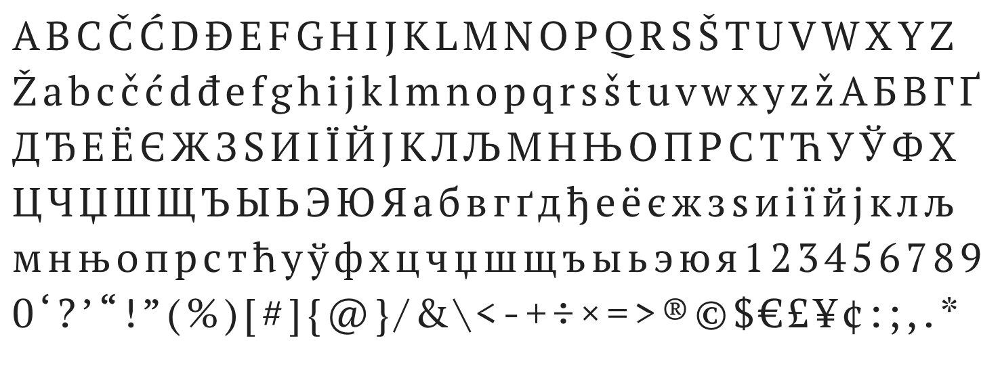
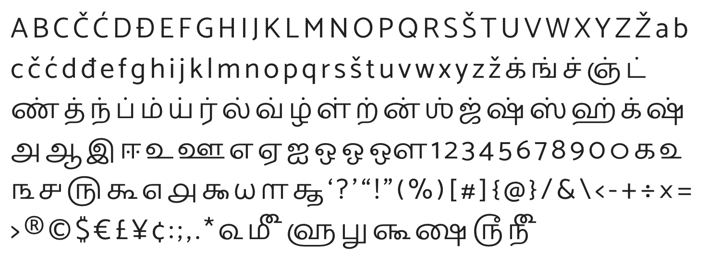

# Visual Identity & Branding

Documentation and guidelines for the VI of The Atlas of Data

## Naming & Abbreviation

- Usual name : The Atlas of Data
- Full name : The Atlas of Data on Earth
- Initials : AOD
- social : @atlasofdata
- website : http://theatlasofdata.earth

## Logo

Info about the logo in [`logo`](./logo).

#### Logotype / wordmark

### Changing Datum

The visual identity of the AOD is based on the concept of a *changing datum*.

A datum is a common reference point used to measure and plan the building of things. Fact is, our world is changing so fast that what we considered references are changing with it. Also, there are new space beyond the geographical one where we need to define new references.

That is why the identity of AOD express a reference point that is constantly moving.

### Datum, a reference points

- the singular form of data
- a standard point for measurements in geo or nautical surveys
- a reference point to calculate dimensions in engineering projects

See the [Wikipedia disambiguation page](https://en.wikipedia.org/wiki/Datum_(disambiguation)) for more.

### Changing

The world is changing faster than we can understand, and that is maybe the main reason for this project to exist. The logo reflects this idea of change by its movement. Therefore, the logo is dynamic and generative.

## Font

All selected fonts have the following requirements :

- readability first, should pass the "Il1" test  
- figures have lining and are tabular so numbers are easily readable
- somehow humanists with a modern feel
- free and available under open licenses

## Typefaces

[PT Serif & PT Sans](https://company.paratype.com/pt-sans-pt-serif) is a Serif font by Paratype that was designed for the 300 year anniversary of the civil type invented by Peter the Great in 1708–1710. Based on the cyrillic alphabet, it was created during the project “Public Types of the Russian Federation”. It is a transitional serif with humanist terminals, with a serious and modern feel to it. It is free and available under an open license.

[Catamaran](https://github.com/VanillaandCream/Catamaran-Tamil) is a Sans Serif humanist font made by Indian designer Pria Ravichandran. A bit similar to Withney, it has some fun to it, but also gives a sense of regularity and calm. Like the catamaran, it is a light embarcation you can ride to cross oceans. It pairs nicely with the Chinese font Hei. It is free and open source.

NB: For Chinese characters, we use the Hei font family.

## Typographic guidelines

#### Headings

- Catamaran (sans)
- Pentatonic scale for headings variation

#### Body Text

- PT Serif
- serif, 20px
- line length : 75 characters
- 1.35 spacing

## Colors

Readability
High constrast
